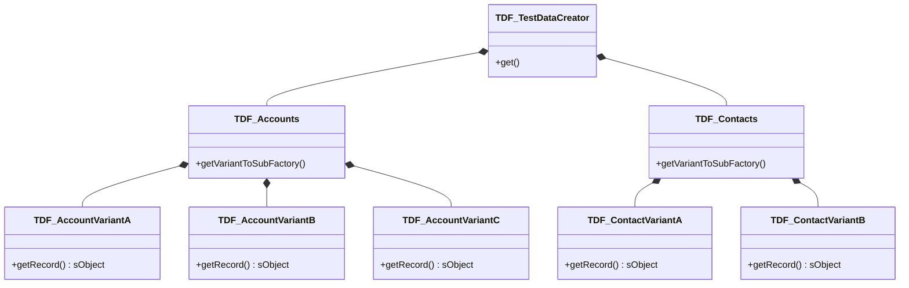
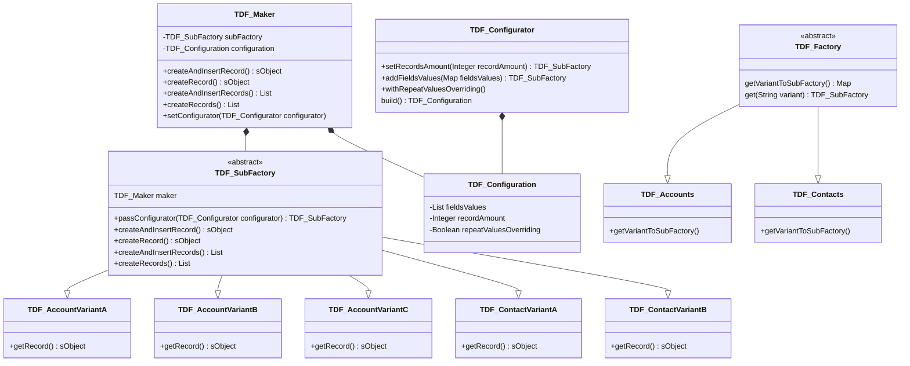

# Test Data Factory

Test Data Factory is a framework that allows you to create test records in simple manier.

## Benefits
- Low classes dependencies
- Single Responsibility Principle - Each factory is responsible to create specific set of data
- Open/Close Principle - Easy to add new factories without changing existing code
- Easy to understand
- Easy to use

## Architecture





## How to use?

```java
    //simple creation - one record
    TDF_TestDataCreator.get(Account.sObjectType).get('VARIANT_A').createAndInsertRecord();
    // {Account: {Name: 'Variant A1'}}
    TDF_TestDataCreator.get(Contact.sObjectType).get('VARIANT_B').createAndInsertRecord();
    // {Contact: {Name: 'Variant B1'}}

    //simple creation - multiple records
    TDF_TestDataCreator.get(Account.sObjectType).get('VARIANT_A')
        .passConfigurator(
            new TDF_Configurator().setRecordsAmount(5)
        ).createAndInsertRecord();
    // [
    //     {Account: {Name: 'Variant A1'}},
    //     {Account: {Name: 'Variant A2'}},
    //     {Account: {Name: 'Variant A3'}},
    //     {Account: {Name: 'Variant A4'}},
    //     {Account: {Name: 'Variant A5'}}
    // ]
    TDF_TestDataCreator.get(Contact.sObjectType).get('VARIANT_B')
        .passConfigurator(
            new TDF_Configurator().setRecordsAmount(2)
        ).createAndInsertRecord();
    // [
    //     {Contact: {Name: 'Variant B1'}},
    //     {Contact: {Name: 'Variant B2'}}
    // ]

    //override or pass values - one record
    TDF_TestDataCreator.get(Account.sObjectType).get('VARIANT_A')
        .passConfigurator(
            new TDF_Configurator()
                .addFieldsValues(
                    new Map<sObjectField, Object>{
                        Account.Name => 'Custom Name'
                    }
                )
        ).createAndInsertRecord();
    // {Account: {Name: 'Custom Name'}}

    TDF_TestDataCreator.get(Contact.sObjectType).get('VARIANT_B').addFieldsValues(
        new Map<sObjectField, Object>{
            Contact.Name => 'Custom Name'
        }
    ).createAndInsertRecord();
    // {Contact: {Name: 'Custom Name'}}

    //override or pass values - multiple records
    TDF_TestDataCreator.get(Account.sObjectType).get('VARIANT_A')
        .passConfigurator(
            new TDF_Configurator()
                .setRecordsAmount(5)
                .addFieldsValues(
                    new Map<sObjectField, Object>{
                        Account.Name => 'Custom Name for Record 1'
                    }
                )
                .addFieldsValues(
                    new Map<sObjectField, Object>{
                        Account.Name => 'Custom Name for Record 2'
                    }
                )
                .addFieldsValues(
                    new Map<sObjectField, Object>{
                        Account.Name => 'Custom Name for Record 3'
                    }
                )
        )
        .createAndInsertRecord();
    // [
    //     {Account: {Name: 'Custom Name for Record 1'}},
    //     {Account: {Name: 'Custom Name for Record 2'}},
    //     {Account: {Name: 'Custom Name for Record 3'}},
    //     {Account: {Name: 'Variant A4'}},
    //     {Account: {Name: 'Variant A5'}}
    // ]

    //override or pass values - multiple recordsc - with repeat values overriding
    TDF_TestDataCreator.get(Account.sObjectType).get('VARIANT_A')
        .passConfigurator(
            new TDF_Configurator()
                .setRecordsAmount(5)
                .withRepeatValuesOverriding()
                .addFieldsValues(
                    new Map<sObjectField, Object>{
                        Account.Name => 'Custom Name for Record 1'
                    }
                )
                .addFieldsValues(
                    new Map<sObjectField, Object>{
                        Account.Name => 'Custom Name for Record 2'
                    }
                )
                .addFieldsValues(
                    new Map<sObjectField, Object>{
                        Account.Name => 'Custom Name for Record 3'
                    }
                )
        )
        .createAndInsertRecord();
    // [
    //     {Account: {Name: 'Custom Name for Record 1'}},
    //     {Account: {Name: 'Custom Name for Record 2'}},
    //     {Account: {Name: 'Custom Name for Record 3'}},
    //     {Account: {Name: 'Custom Name for Record 1'}},
    //     {Account: {Name: 'Custom Name for Record 2'}}
    // ]
```

## How to create new Test Data Factory?

1. Create new variant class `TDF_MyObjectVariant`. Replace `MyObjectVariant` to match your business purpse like. `TDF_AccountPartner`, `TDF_ContactCustomer` etc.
2. Your class should extends `TDF_SubFactory` and implements `getRecord` methods.
```java
public class TDF_MyObjectVariant extends TDF_SubFactory {
   public override sObject getRecord(Integer index) {
        return new MyObject(
            Name = 'Dummy Name' + index
        );
    }
}
```
3. Create new class `TDF_MyObjects` (**if not exist**). Replace `MyObjects`. eg. `TDF_Accounts`, `TDF_Contacts`
4. You class should extends `TDF_Factory`
```java
public class TDF_MyObjects extends TDF_Factory {
  protected override Map<String, System.Type> getVariantToSubFactory() {
    return new Map<String, System.Type>{
      'VARIANT_A' => TDF_MyObjectVariantA.class,
      'VARIANT_B' => TDF_MyObjectVariantB.class
    };
  }
}
```
5. Add variant created in step 1 to Map in step 4.
6. Open TDF_TestDataCreator and add you Factory to map.
```java
  private final static Map<sObjectType, System.Type> OBJECT_TO_FACTORY = new Map<sObjectType, System.Type>{
    Account.sObjectType => TDF_Accounts.class,
    Contact.sObjectType => TDF_Contacts.class,
    MyObject.sObjectType => TDF_MyObjects.class
  };
```
7. Done. You can invoke you factory `TDF_TestDataCreator.get(MyObject.sObjectType).get('VARIANT_A').createAndInsertRecord();`
